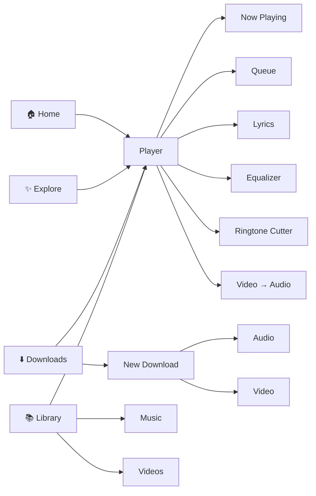
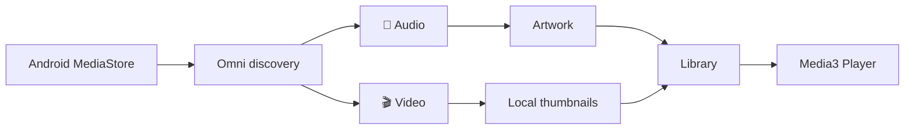
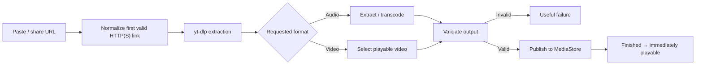
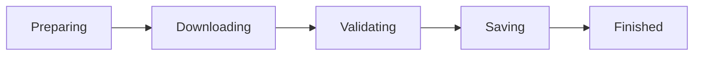
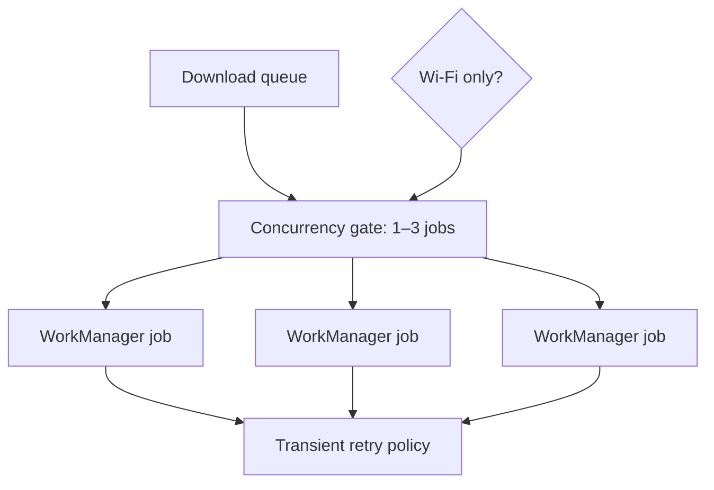
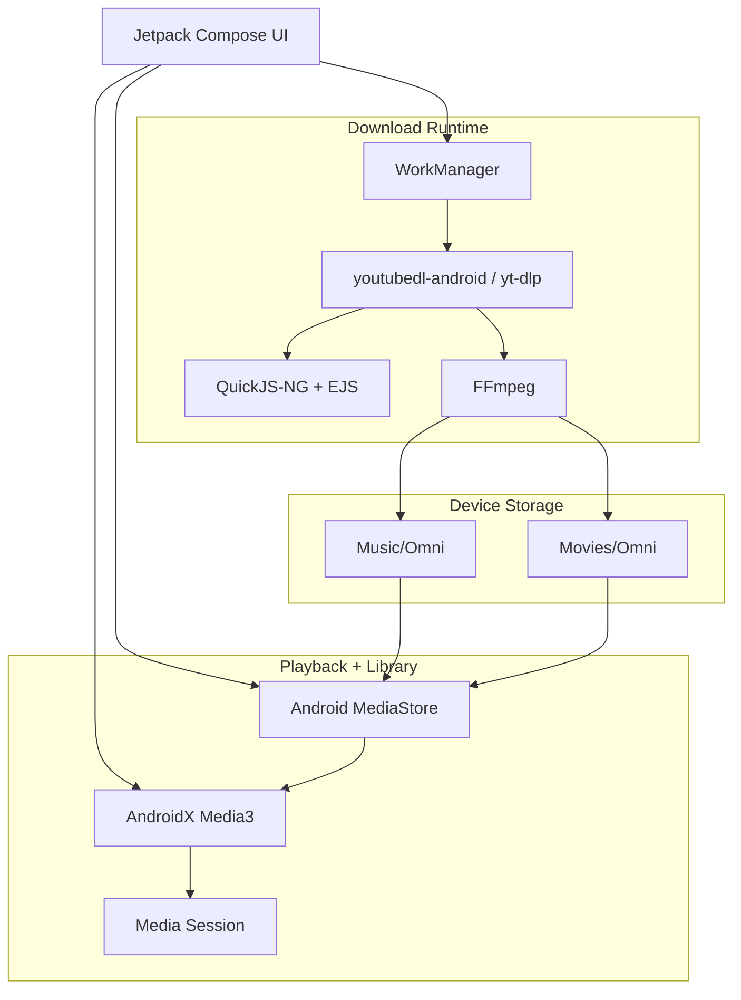

<div align="center">

# 🎧 Omni Player for Android

### Local-first playback, media library, and website-media downloads — without accounts, ads, analytics, or an Omni cloud service.

<br>


**Free · Ad-free · Local-first · No account · No analytics · No paywall**

Made by **Cynex1702**

</div>

---

## ✨ What is Omni?

**Omni Player** is an Android audio/video player, device media library, and website-media downloader designed around local control.

It has:

- no account system
- no advertising SDK
- no analytics SDK
- no paywall
- no remote Omni service requirement

Playback, media discovery, downloads, conversion, clipping, and most application state stay on the device.

---

## 🚀 1.3.0 at a glance

| Area | What Omni provides |
|---|---|
| 🎵 Audio | Media3 playback, queue, seek, shuffle, repeat, speed, favorites, resume, mini-player |
| 🎬 Video | Responsive portrait/landscape/full-screen player, gestures, tracks, subtitles, PiP, lock |
| 📚 Library | MediaStore audio/video discovery, artwork, thumbnails, Music and Video destinations |
| ⬇️ Downloads | yt-dlp extraction, direct-media URLs, WorkManager jobs, retries, progress, cancellation |
| 🎚️ Audio tools | 5-band EQ, bass boost, virtualizer, reverb, ringtone clipping |
| 🔄 Conversion | MP3 extraction and compatible local-video AAC → M4A |
| 🎨 UI | Graphite-and-coral design, AMOLED and Editorial Luxe themes |
| 🔒 Privacy | No Omni account, ad SDK, analytics SDK, or remote Omni backend |
| 📱 Android | Android 8.0 / API 26 and newer |

---

## 🧭 App map



---

## 🎨 Interface

Version **1.3.0** introduces a cohesive **graphite-and-coral** interface with:

- four-tab primary navigation
- quick-link download entry
- editorial Explore content
- storage-aware Library
- compact mini-player
- redesigned Now Playing screen
- persistent player appearance preference

### Themes

| Theme | Character |
|---|---|
| 🌑 **Immersive AMOLED** | Deep-black playback-focused presentation |
| 📰 **Editorial Luxe** | More expressive editorial visual treatment |

The launcher uses the supplied black-and-silver Omni wing artwork, including Android 12+ splash presentation and a monochrome themed-icon layer.

---

## 🎧 Audio experience

Audio playback includes:

- Square Cover appearance
- Vinyl Disc appearance
- Wave Circle appearance
- queue management
- seek
- shuffle
- repeat
- playback speed
- sleep timer
- favorites
- recents
- resume position
- buffering/error/retry states
- notification controls
- lock-screen controls
- background playback

### Audio effects

Where the device supports them, Omni connects effects to the active playback audio session:

```text
5-band Equalizer
      +
Bass Boost
      +
Virtualizer
      +
Reverb
```

---

## 🎬 Video experience

Video uses a dedicated **canvas-first controller** rather than simply reusing the audio interface.

Supported interactions include:

- portrait layout
- landscape layout
- full-screen playback
- gestures
- audio/video track selection
- subtitle controls
- display controls
- player lock
- Picture-in-Picture

AndroidX **Media3** provides audio/video playback with decoder fallback and Android media-session integration.

---

## 📚 Local media library

Omni discovers device audio and video through Android **MediaStore**.



The Library separates:

- **All Media**
- **Music**
- **Videos**

Music uses an audio-focused list, while videos use a dedicated landscape-thumbnail grid.

---

## ⬇️ Website-media downloads

Omni accepts one user-supplied **HTTP/HTTPS** media page or direct-media URL per task when supported by the active yt-dlp extractor.

It uses:

- `youtubedl-android`
- `yt-dlp 2026.07.04`
- FFmpeg
- ABI-matched QuickJS-NG `0.15.0`
- embedded EJS solver scripts for current YouTube JavaScript challenges

### Download pipeline



### Progress states



Omni exposes:

- live percentage
- transferred bytes
- download speed
- ETA
- foreground progress
- cancellation
- transient retry handling
- download history

---

## 🎵 Audio downloads

MP3 extraction supports:

- **128 kbps**
- **192 kbps**
- **320 kbps**

Metadata and artwork can be attached to the resulting audio.

---

## 🎥 Video downloads

Selectable targets include:

- up to **360p**
- up to **720p**
- up to **1080p**
- **best available**

Omni prefers Android-friendly **MP4**.

When a valid source is only available in another playable container, **WebM/MKV** can be retained rather than falsely rejecting the source.

---

## ⚙️ Download scheduling

Each transfer is handled as an independent **WorkManager** job.



Supported behavior includes:

- Wi-Fi-only mode
- configurable 1–3 download concurrency
- foreground execution
- cancellation
- automatic transient retries
- Android share/open-link handling

Extractor-update failures retry after **15 minutes**. Only successful updates count toward the three-day update interval, and Omni falls back to its bundled extractor when an update is unavailable.

---

## 🧹 Input normalization

Shared text and form input are normalized to the first valid HTTP/HTTPS media link.

That means text such as:

```text
hey check this out https://example.com/media/123 it looks good
```

can still resolve to the media URL without requiring the user to manually clean the message first.

---

## 🛡️ Validation and failure handling

Omni validates media before reporting a download as complete.

The app does **not** falsely mark these as successful:

- HTML pages saved as media
- empty output
- DRM/encrypted media
- live streams
- unplayable files

A valid completed file is published to:

```text
Music/Omni
```

or:

```text
Movies/Omni
```

on Android 10+.

Finished media can be opened immediately from **Downloads → Finished**.

---

## 🚫 Download scope

Omni intentionally does **not** bypass access controls.

The current release does not handle:

| Unsupported scope | Reason |
|---|---|
| 🔐 DRM / encrypted media | Access-control bypass is not part of Omni |
| 🔴 Live streams | Intentionally unsupported |
| 📚 Playlists / bulk channel downloads | One user-supplied item per task |
| 👤 Login-only media | No signed-in browser session or cookie import |
| 💳 Paid media | Not handled through access circumvention |
| 🚷 Unauthorized saving | Users must have permission to save the media |

> Website behavior changes frequently. Extractor support can change even when the Omni application itself has not changed.

---

## ✂️ Media tools

### Ringtone Cutter

Supports clipping:

- MP3
- AAC / M4A

### Video → Audio

Compatible local video can have its AAC audio extracted to **M4A**.

---

## 🏗️ High-level architecture



For the implementation map, see [`docs/ARCHITECTURE.md`](docs/ARCHITECTURE.md).

---

## 🧰 Technology stack

| Component | Version |
|---|---:|
| Gradle | `8.9` |
| Android Gradle Plugin | `8.7.3` |
| Kotlin | `2.0.21` |
| Compose BOM | `2024.12.01` |
| AndroidX Media3 | `1.5.1` |
| youtubedl-android | `0.17.3` |
| yt-dlp | `2026.07.04` |
| QuickJS-NG | `0.15.0` |
| JDK | `17` |
| Android SDK | `35` |
| Minimum Android | `8.0 / API 26` |

> The native yt-dlp/FFmpeg runtime makes the final APK substantially larger than a player-only application. First initialization can also take a few seconds.

---

## ▶️ Open and run

1. Extract the project archive into a new folder.
2. Open the folder containing `settings.gradle.kts` in **Android Studio**.
3. Select **JDK 17**.
4. Install **Android SDK 35** if prompted.
5. Allow Gradle sync to download the native yt-dlp/FFmpeg dependencies.
6. Run the `app` configuration on **Android 8.0 / API 26** or newer.
7. Grant audio, video, and notification permissions when requested.

---

## 🧪 Device validation checklist

### Local playback

- Put an MP3/M4A file on the device.
- Put an MP4/WebM file on the device.
- Rescan Library.
- Play both.

### Audio download

1. Paste an authorized, publicly accessible supported page into **New Download**.
2. Choose **Audio → 192 kbps**.
3. Confirm the following states appear:

```text
Preparing → Downloading → Validating → Saving
```

4. Play the result from **Downloads → Finished**.

### Video download

1. Repeat with **Video → 720p**.
2. Confirm the resulting MP4, WebM, or MKV has picture and — when present in the source — sound.

### Reliability

Test:

- cancel running task
- retry failed task
- Android share-to-Omni
- Wi-Fi-only mode
- background playback
- seek / pause
- notification controls
- return to full player

### Failure cases

Try:

- DRM media
- live stream
- login-only link
- unsupported link

Omni should display a useful failure rather than remain in an endless loading state.

---

## 🗺️ Documentation

- [`docs/ARCHITECTURE.md`](docs/ARCHITECTURE.md) — implementation map
- [`docs/ROADMAP.md`](docs/ROADMAP.md) — release validation and future direction
- [`THIRD_PARTY_NOTICES.md`](THIRD_PARTY_NOTICES.md) — third-party licensing
- [`LICENSE`](LICENSE) — project license

---

## ⚖️ License

The current source release is documented as **GNU General Public License version 3 (GPLv3)**.

Omni uses the GPL-licensed `youtubedl-android` runtime to run yt-dlp and FFmpeg on-device. Review both:

- [`LICENSE`](LICENSE)
- [`THIRD_PARTY_NOTICES.md`](THIRD_PARTY_NOTICES.md)

> [!IMPORTANT]
> The previous README text also described the project as “source-available and free for personal, educational, and non-commercial use.” That restriction is **not equivalent to GPLv3** and should not be presented as an additional restriction on code distributed under GPLv3. If you want to apply the Cyanex Community Non-Commercial License to separable original components, define the licensing boundary explicitly and verify that the resulting distribution remains compliant with all GPL obligations.

---

<div align="center">

### 🎧 Omni

**Your media. Your device. Your playback.**

No account · No ads · No analytics · No Omni cloud requirement

</div>
